<div align="center">



<br/>

<a href="https://www.linkedin.com/in/scottlai0/">
  
</a>


</div>

```bash
scott@github:~$ cat about.txt
> Building web apps, data pipelines, DevOps tooling & internal platforms
> Currently exploring Vertex AI Feature Store on GCP
```

### `scott@github:~$ echo $STACK`
```bash
python · typescript · react · angular · fastapi · gcp · docker · mongodb · postgres · git
```

### `scott@github:~$ ls ./projects`

| Project | Description | Stack |
|---|---|---|
| `automatic-pancake/` 🔒 | No-code orchestration platform for DevOps workflows *(internal · enterprise)* |   |
| [`machine-learning-feature-pipeline/`](https://github.com/scottlai0/machine-learning-feature-pipeline) | Feature engineering pipeline with Vertex AI Feature Store |   |
| [`ldap_api/`](https://github.com/scottlai0/ldap_api) | Fetch & verify corporate users by LDAP group |   |

### `scott@github:~$ ./snake.sh`

<p align="center">
  <picture>
    <source media="(prefers-color-scheme: dark)" srcset="https://raw.githubusercontent.com/scottlai0/scottlai0/output/snake.svg" />
    <source media="(prefers-color-scheme: light)" srcset="https://raw.githubusercontent.com/scottlai0/scottlai0/output/snake-light.svg" />
    
  </picture>
</p>

```diff
+ status: open to collaborating on fullstack / data / DevOps projects
+ contact: linkedin.com/in/scottlai0
```
